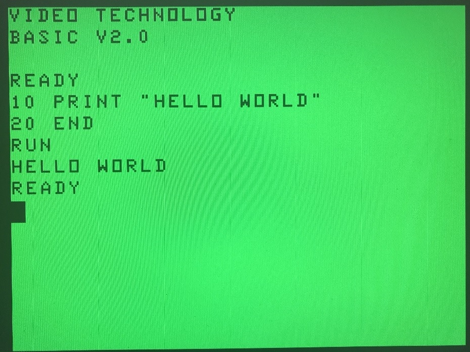

# LASER310 FPGA

Welcome to LASER310_FPGA project. This project is an attempt to recreate the once famous VZ300/Laser300 computer in 80's on Cyclone based FPGA boards.

Features implemented:
1. MC6847 /w VGA output
2. Cassette input/output emu
3. Laser310 internal RAM/ROM/DOS ROM on flash
4. Buzzer output
5. PS/2 keyboard support (Ctrl+F12 to reset).
6. 20MHz overclock on SW1

***Planned***
1. Super high resolution mode (256*192)
2. Z80 bus on GPIO mapping.
3. VZ200 support
4. 16K/64 RAM module
5. Enable external ROM with onboard switches at runtime.

***Screenshots***  
IORQ output n,5 captured on GPIO1  
  

***Supported boards***

- Terasic DE0
- Terasic DE1
- Terasic DE2
- Terasic DE2-70
- Terasic DE2-115

***Folder structures***

doc_LASER310:

Laser310 Ext Basic P1.5c and user manual.

Laser310 System B and user manual.

Laser310 Monitor and user manual

Cassette output encoding details.

Laser310 keyboard encoding schema

Laser310 oscilloscope screenshot of cassette output 

rom:

VZ300/Laser310 roms

Software:

development tools for this project. 

vz:

Some come games for testing.

SYSTEM-B.vz is a binary file loading/saving tool for cassette/disk on Laser 310.

BASIC_P1.5C.vz is an extended Basic for Laser 310 developed by XinMin Peng in 80's.

MONITORR.vz is an award winning CALL-151 like system monitor tool for Laser 310.

More details on these VZ300/Laser310 softwares to follow.

